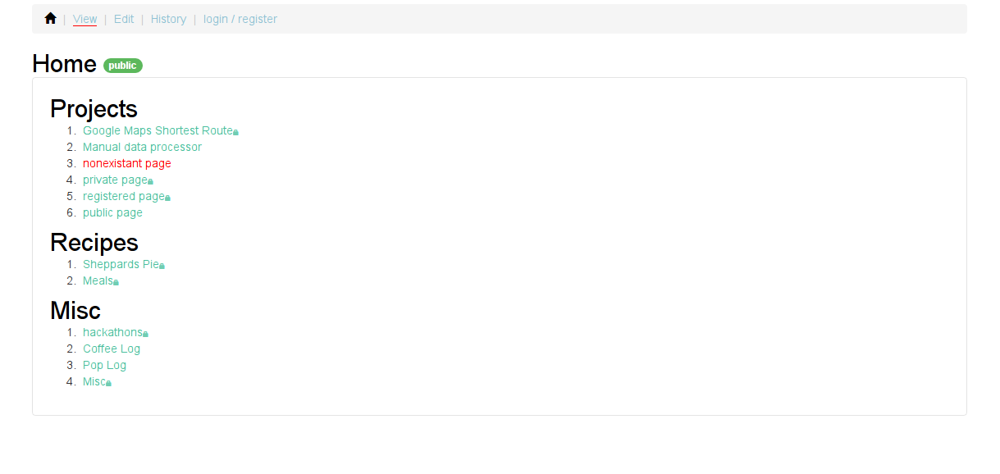

# Jabawiki
File based personal wiki.

**Currently under development.**


## Install
- You can download a tarball with a prebuilt executable for your platform [here](https://github.com/BenDoan/jabawiki/releases)
- Unpack the tarball with ```tar -xf jabawiki-x.x.x.tar.gz```
- Start the jabawiki with ```./jabawiki```
- (Optional) Edit ```config.toml``` to change the wiki configuration
- (Optional) After an account is registered, its role will need to be changed to admin to view or edit the wiki. To do this: in data/users.txt change the 3rd field of that user to 1. A more in-depth permissions system is in the works.

## Build
- Download go dependencies with ```go get```
- Download javascript dependencies with ```bower install```
- Build the go code with ```go build```

## Screenshot

